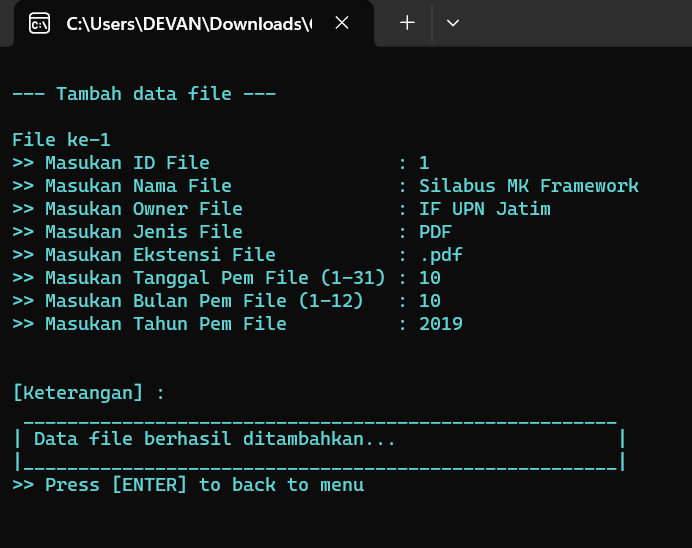
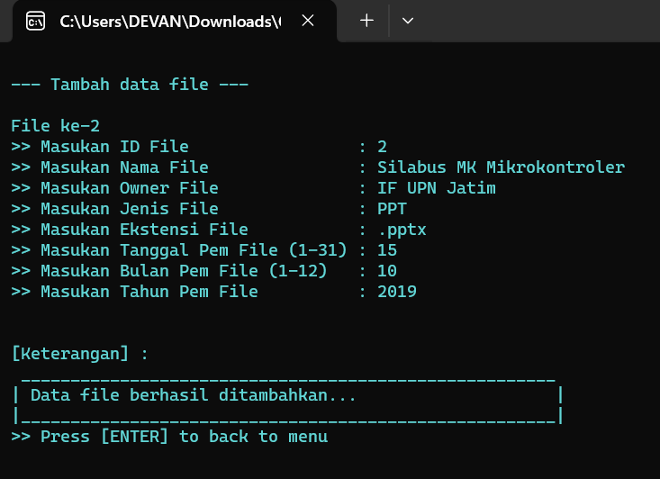
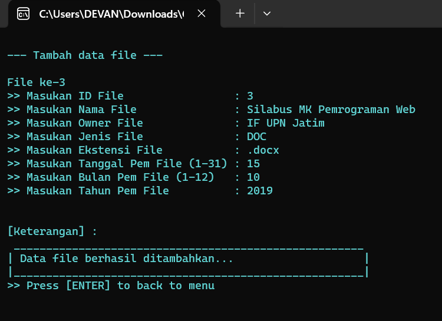
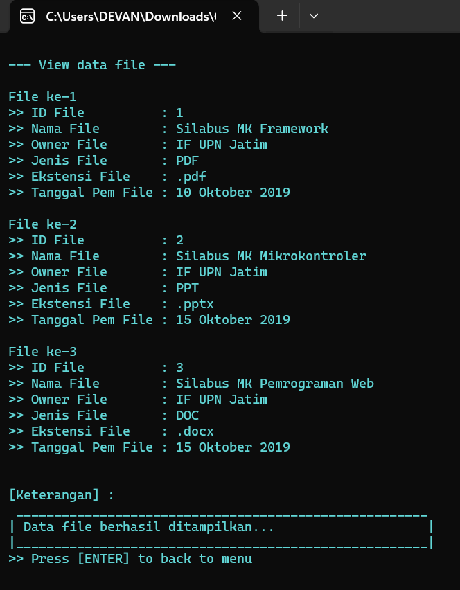
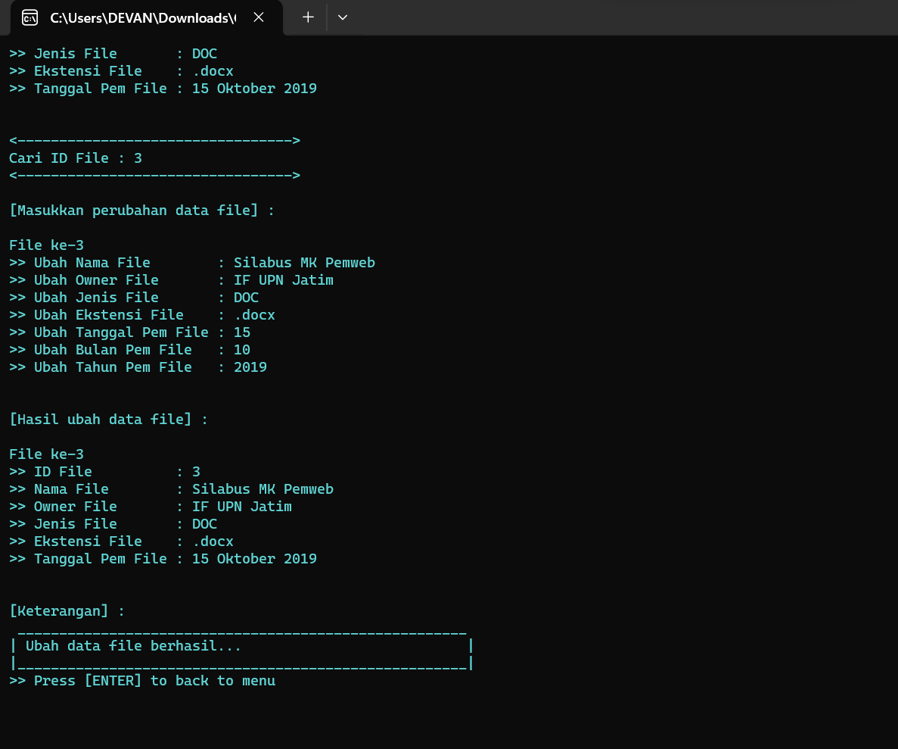
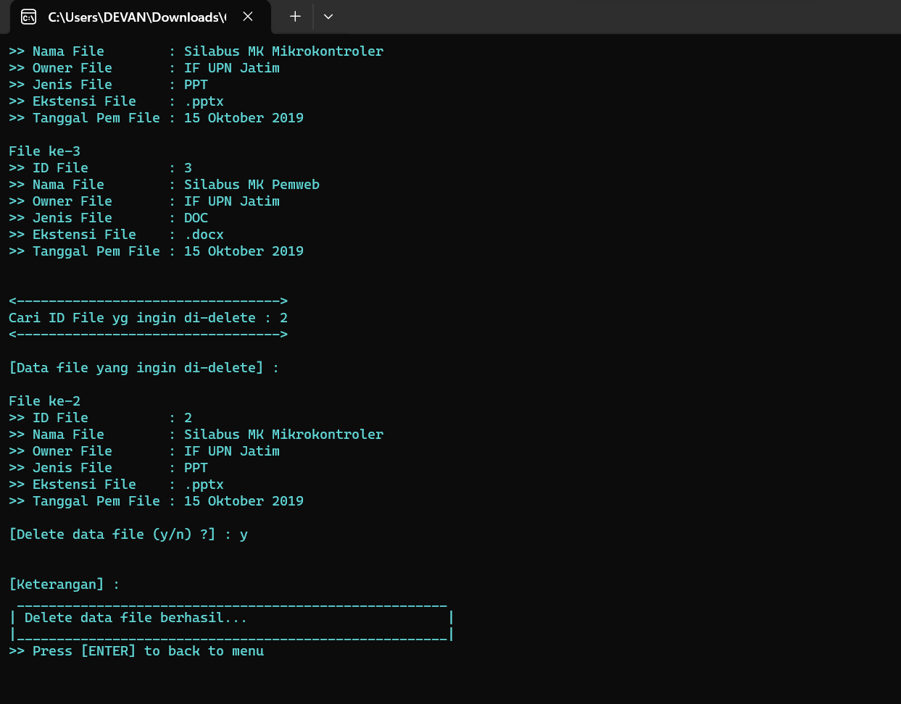
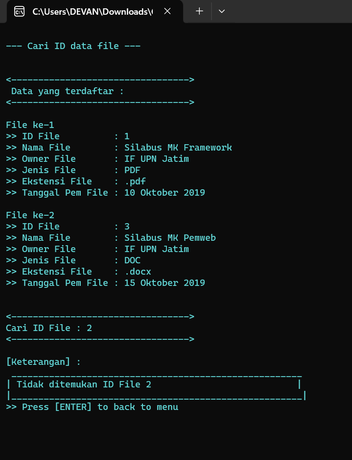
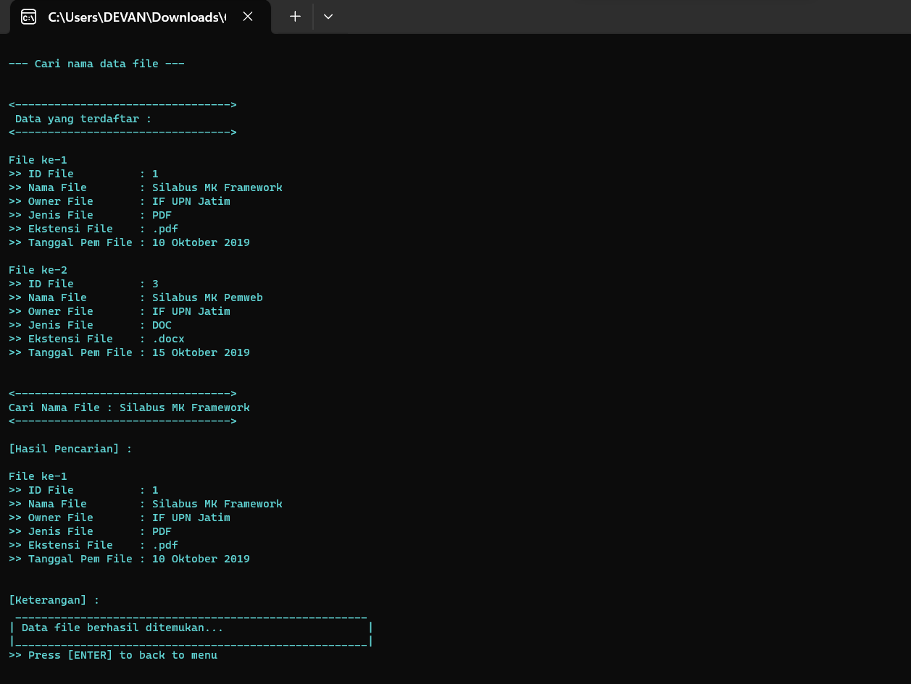
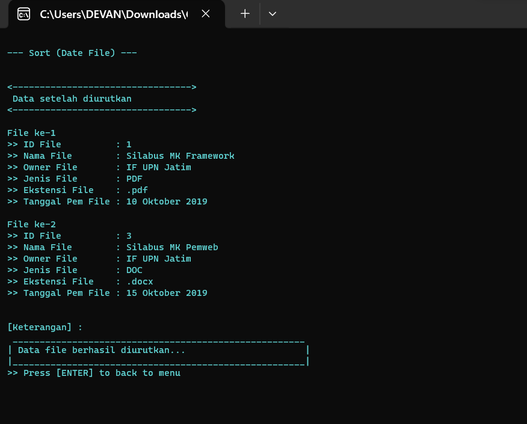

[](https://github.com/ellerbrock/open-source-badges/)
[](https://opensource.org/licenses/MIT)


# Aplikasi-Manajemen-Direktori
<p align="justify">
	The final project that we worked on with the title "Directory Management application" is the final project of the "Advanced Programming" course using the C language. The Directory Management application that we created and developed applies the CRUD (Create, Read, Update, Delete) method and also adds a search method in the form of binary search and a sorting method in the form of insertion sort. In writing this final project report, we will provide some definitions related to the final project title, because without a clear understanding, the information presented will not be in accordance with the final project results presented. Of course, there are other factors that need to be considered in programming, such as error handling and efficiency in writing source code, besides making user friendly programs. All of that is certainly important so that the program made is more functional and easier for users. 
</p>
<br>

## Aim
<p>The aims of this final project are:</p>
	<li>Creating a user-friendly program.</li>
	<li>Can write efficient source code.</li>
	<li>Can create programs that have error handling.</li>
	<li>Can create programs that have more functionality.</li>

<br>

## Conclusion
<p align="justify">
	From the explanation above, we can conclude that the final project we are working on follows the rules of C language programming by implementing the CRUD (Create, Read, Update, Delete) method with additional searches in the form of binary search and sorting in the form of insertion sort, besides that this program prioritizes a user-friendly system and problem control. This is done to make it easier for program users to access the various features we have provided. That's all the reports we can submit regarding the final project of the advanced programming course with the title "Directory Management Application". With the lack of knowledge we have in making this report, we apologize profusely. Finally, we thank you.
</p>

<br>

## Project Requirements
| Part | Description |
| --- | --- |
| Features | • Create<br>• Read<br>• Update<br>• Delete<br>• Search<br>• Sort<br>• Error Handling |
| Tools | Dev C++ |

<br>

## Download & Install Dev C++
<table><tr><td width="840">
	
```
https://bit.ly/DEVC_Installer
```

</td></tr></table>

<br>

## Get Started
1. Download this repository.<br>
2. Extract the file and open it with Dev C++.<br>
3. Run the application program by pressing the F11 key.<br>
4. Please enjoy [Done].

<br>

## Highlights
<table>
<tr>
<th width="420">Splash Screen</th>
<th width="420">Main Menu</th>
</tr>
<tr>
<td></td>
<td></td>
</tr>
</table>
<table>
<tr>
<th colspan="3">Add</th>
</tr>
<tr>
<td width="280"></td>
<td width="280"></td>
<td width="280"></td>
</tr>
</table>
<table>
<tr>
<th width="280">Read</th>
<th width="280">Update</th>
<th width="280">Delete</th>
</tr>
<tr>
<td></td>
<td></td>
<td></td>
</tr>
</table>
<table>
<tr>
<th colspan="3">Search</th>
</tr>
<tr>
<td width="280"></td>
<td width="280"></td>
<td width="280"></td>
</tr>
</table>
<table>
<tr>
<th colspan="2">Sort</th>
</tr>
<tr>
<td width="420"></td>
<td width="420"></td>
</tr>
</table>

<br>

## Creator
| FULL NAME | NPM |
| --- | --- |
| Devan Cakra Mudra Wijaya | 18081010013 |
| Rizqi Yahya Mahendra | 18081010014 |

<br>

## Appreciation
If this work is useful to you, then support this work as a form of appreciation to the author by clicking the ``` ⭐Star ``` button at the top of the repository.

<br>

## LICENSE
MIT License - Copyright © 2019 - Rizqi Y. Mahendra & Devan C. M. Wijaya

Permission is hereby granted without charge to any person obtaining a copy of this software and the software-related documentation files to deal in them without restriction, including without limitation the right to use, copy, modify, merge, publish, distribute, sublicense, and/or sell copies of the Software, and to permit persons receiving the Software to be furnished therewith on the following terms:

The above copyright notice and this permission notice must accompany all copies or substantial portions of the Software.

IN ANY EVENT, THE AUTHOR OR COPYRIGHT HOLDER HEREIN RETAINS FULL OWNERSHIP RIGHTS. THE SOFTWARE IS PROVIDED AS IS, WITHOUT WARRANTY OF ANY KIND, EITHER EXPRESS OR IMPLIED, THEREFORE IF ANY DAMAGE, LOSS, OR OTHERWISE ARISES FROM THE USE OR OTHER DEALINGS IN THE SOFTWARE, THE AUTHOR OR COPYRIGHT HOLDER SHALL NOT BE LIABLE, AS THE USE OF THE SOFTWARE IS NOT COMPELLED AT ALL, SO THE RISK IS YOUR OWN.
